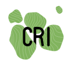

# PROTOCOL OF RESEARCH: The impact of peer-support on self-research and citizen science projects

Copy of document submitted for CRI institutional review board (IRB) - Sent on 12/10/2020; accepted on 22/10/2020.



Organisation responsible for the research | Name and contact information of the researcher conducting the study
------------ | -------------
The Center for Research and Interdisciplinarity (CRI)<br>8bis Rue Charles V, 75004 Paris, France<br>Tel: 01 44 41 25 27 | Responsible for research: Bastian Greshake Tzovaras <br>Function(or Position): CRI Research fellow (INSERM U1284)<br>Work address: 8bis Rue Charles V, 75004 Paris, The centre for Research and Interdisciplinarity(CRI), 2nd floor, office 2.16 <br>Tel: +33 766752149<br>Email: bastian.greshake-tzovaras@cri-paris.org 

## Typology of research

Required fields | Project characteristics
------------ | ------------- 
(1) Prospective / retrospective | The study is prospective. The study will take place upon IRB approval until the end of 2022
(2) Nature of the research | Group study
(3) Genetic study | No
(4) Specific sampling for research | Semi-structured interviews with participants, participant-observation
(5) Constitution of a biological collection | No
(6) Use of an already assembled collection of biological samples | No
(7) | Not applicable
(8) CCTIRS / CNIL | Our DPO point of contact at CRI is Lionel Deveaux lionel.deveaux@cri-paris.org
(9) Products of human origin | 

## Abstract

“Citizen science” describes the practice of scientific research that is conducted in part or completely by amateurs or non-professional researchers, often in groups or communities. A highly related practice and subdomain of citizen science is that of "personal science", which describes research fully conducted by an individual to understand a phenomenon, commonly an aspect of their own lives - e.g. their health, habits or behavior. Personal science, as a form participant-lead research, constitutes a growing movement around the exploration of personal health questions using self-collected data, in which individuals develop their own research projects mainly to learn about themselves. Despite its growing popularity, there are little support frameworks to enable individuals to successfully perform their self-research, nor evidence on how it can relate or contribute to other paradigms of open collaboration. We aim to create a better understanding of the interactions, principles and motivations that drive participant-led research within the space of citizen and personal science, to lay the groundwork for potential future improvements of such support frameworks. 

In particular we are interested in the following questions that we want to answer: (1) What are the current barriers and opportunities for enabling personal science processes through open communities of practice? (2) What is the role of peer-to-peer support among self-researchers to generate relevant insights from their research projects? (3) What are the types of individual and community learning processes that take place? (4) What are intrinsic and extrinsic motivations for participating in the different stages of personal research among peers?

To explore these questions we will work with citizen scientists and people performing personal science within the framework of the Open Humans system and the Quantified Self community. These communities have thousands of members and  provide citizen scientists and self-researchers with a digital infrastructure (e.g. online forums) as well as facilitated interactions among them (e.g. weekly virtual meeting space), providing an ideal community to answer our research questions. 
To collect relevant data in this early exploratory phase we will use the qualitative methods of semi-structured interviews with community members alongside participant observation techniques at the virtual meeting spaces to gain insights on how personal science is being performed and the community dynamics present. This will allow us to develop a wider comprehensive analytical approach that describes and reflects motivations, as well as the different interaction dynamics that are taking place in relation to shared processes and principles.  

### Introduction

Citizen science is currently a broad and diverse research practice where members of the public and non-professional scientists collaborate with professional scientists to conduct scientific research, usually aided by Information and Communication Technologies (ICT) and other digital tools (Bonney et al., 2019). As a still emergent and evolving phenomena, citizen science projects to date respond to different typologies and classifications, depending on the type of interaction they articulate: from those in which citizen researchers are trained only for basic data collection tasks, to other participatory models in which amateur researchers can also collaborate in problem definition, data collection and analysis (Haklay, 2013). This later perspective emphasizes the potential of citizens to deal actively with questions that are relevant to their lives (Irwin, 2015), and also connects to key issues of engagement, learning and knowledge creation processes (Jennett et al., 2016).

Personal science (or personal research) is a specific type of participatory citizen science (Heyen, 2016), which can be defined as the practice of using empirical methods to explore personal questions (Wolf & De Groot, 2020). It covers activities and practices for science-based production of knowledge initiated or operated by citizens or laypeople, usually in relation to their own personal health (Heyen & Dickel, 2019). Personal science has its origins in the long tradition of self-experimentation, especially in the medical sciences (Neuringer, 1981), as well as in connection with new approaches to participant-led research (Vayena et al., 2016). Personal science is characterised by individuals performing self-tracking activities, usually aided by digital tools, for the permanent gathering and evaluation of self-related data in their daily life (Heyen, 2020). Usually coordinated and articulating peer support through specific online communities of practice, like Open Humans (Greshake Tzovaras et al., 2019) or Quantified Self (Lupton, 2016), self-tracking data is generated via wearables and other methods and analyzed regularly (Grant & Wolf, 2019). Often data is uploaded and shared via these web platforms, open for reuse and for group discussions regarding the possible consequences for the person’s own health or daily behavior (Pantzar & Ruckenstein, 2017). Some recent research on Open Humans has focused on the motivations and ethical oversight of personal data sharing (Fadda et al., 2018), but not on the personal science practices.

Recently various topics related to personal science have been studied in diverse depth, such as questions of project governance (Grant & Wolf, 2019), the management of self-generated data (Hall, 2014) or new conceptual models to understand the phenomenon (Wolf & De Groot, 2020). However, there is still little literature and systematic studies about other key factors that characterize this type of participant-lead research, especially in connection with advances in open online collaboration and citizen science. For this, it is necessary to explore in greater depth key factors of participation and collaboration related to the motivations and expectations of self-researchers, the learning dynamics and knowledge sharing processes they generate, their group dynamics and the facilitation processes and infrastructure technology in which they participate.


## Welcome to GitHub Pages

You can use the [editor on GitHub](https://github.com/PeerProducedResearch/Keating-Memorial-research/edit/main/README.md) to maintain and preview the content for your website in Markdown files.

Whenever you commit to this repository, GitHub Pages will run [Jekyll](https://jekyllrb.com/) to rebuild the pages in your site, from the content in your Markdown files.

### Markdown

Markdown is a lightweight and easy-to-use syntax for styling your writing. It includes conventions for

```markdown
Syntax highlighted code block

# Header 1
## Header 2
### Header 3

- Bulleted
- List

1. Numbered
2. List

**Bold** and _Italic_ and `Code` text

[Link](url) and 

```

First Header | Second Header
------------ | -------------
Content from cell 1 | Content from cell 2
Content in the first column | Content in the second column

For more details see [GitHub Flavored Markdown](https://guides.github.com/features/mastering-markdown/).

### Jekyll Themes

Your Pages site will use the layout and styles from the Jekyll theme you have selected in your [repository settings](https://github.com/PeerProducedResearch/Keating-Memorial-research/settings). The name of this theme is saved in the Jekyll `_config.yml` configuration file.

### Support or Contact

Having trouble with Pages? Check out our [documentation](https://docs.github.com/categories/github-pages-basics/) or [contact support](https://github.com/contact) and we’ll help you sort it out.
